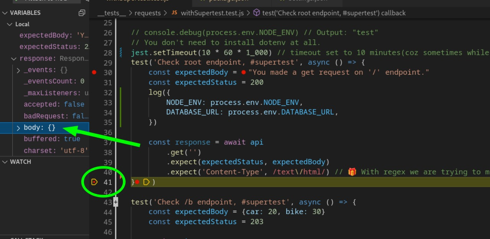
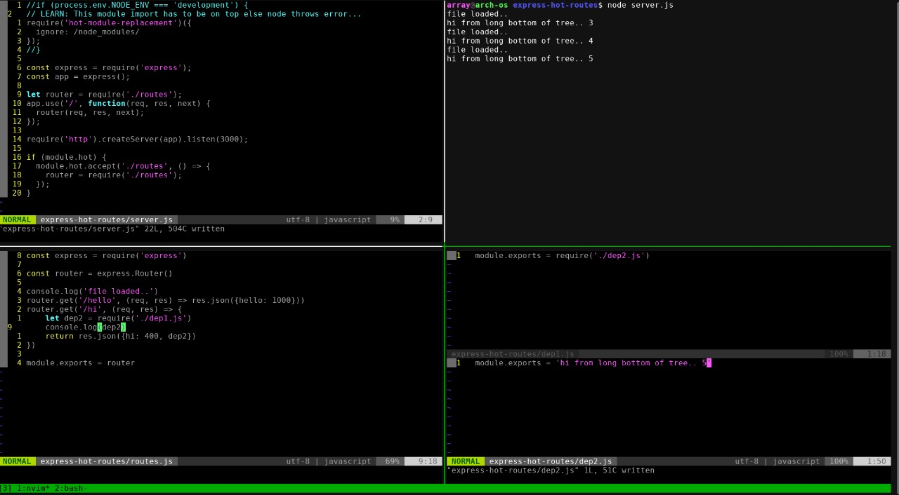

# Learn Express

**Quick Links:**

- ❤️❤️ with-typescript: [learn-express/socket-minimal-example](https://github.com/sahilrajput03/learn-express/tree/main/with-typescript)
- ❤️ Learn node: [Click here](./learn-node/README.md)
- ❤️ Learn multer: [Click here](./learn-multer)
- ❤️ with-jest-supertest-axios: [learn-express/with-jest-supertest-axios](https://github.com/sahilrajput03/learn-express/tree/main/with-jest-supertest-axios)
- ❤️ socket-minimal-example: [learn-express/socket-minimal-example](https://github.com/sahilrajput03/learn-express/tree/main/socket-minimal-example)
- ❤️ Web Push Notification: [learn-express/node_push_notifications](https://github.com/sahilrajput03/learn-express/tree/main/node_push_notifications)
- Learn node: [learn-express/learn-node](https://github.com/sahilrajput03/learn-express/tree/main/learn-node)
  - ❤️ Learn Process Management in Nodejs: [learn-express/learn-node/process-management](https://github.com/sahilrajput03/learn-express/tree/main/learn-node/process-management)
    - ❤️❤️ switch-process-manager: [learn-express/learn-node/process-management/switch-process-manager](https://github.com/sahilrajput03/learn-express/tree/main/learn-node/process-management/switch-process-manager)
- ❤️ console-and-file-log: [learn-express/console-and-file-log](https://github.com/sahilrajput03/learn-express/tree/main/console-and-file-log)
- Expressjs Docs:
  - Interesting middleware:
    - ❤️🚀🧨 Helpful to handle traffic (or host static-content sites) on subdomains easily: [vhost](https://expressjs.com/en/resources/middleware/vhost.html)
- ❤️ Learn mocha: [Click here](./learn-mocha/README.md)

For full _hot+flash+database_connected_ please refer to `testing-hot-flash` directory in this repo.

- **(Failue attempt to help share common files b/w frontend and backend)** Svelte + Expressjs: [sahilrajput03/svelte-express](https://github.com/sahilrajput03/svelte-express)

**Please keep below text for future references of offline repos to be trackable back to this repo.**

- Added `async-config-in-servers` mini-setup done with Lalit @blulabs
- Added `test-quokkajs-with-express` repo.
- Added `expressReqBodyWithTypeGuarding` repo.
- Added `express-testing-middlwares-with-nextCalls` repo.
- Added `cookies-and-requests-with-express`
- Added `react-express` repo.
- Added `jwt-secure-authorization` repo.
- Added `nodejs-development-in-docker-container` repo.
- Added `node-hot-api-testing` repo.
- Added `node-modules-concept` repo.
- Added `learning_javascript_nodejs` repo.
- Added `custom-NODE_PATH` repo.
- Added `ecma-wonder-in-node` repo.
- Added `learn-assertions` repo.

**Quick Links:**

- Learn limiting concurrent requests with [`queue()`](https://caolan.github.io/async/v3/docs.html#queue) of [`async`](https://caolan.github.io/async/v3/) library (awesome): [Click here](learn-limiting-concurrent-requests.md)

## `after` library

https://github.com/Raynos/after#naive-example

```js
var after = require("after")
    , next = after(3, logItWorks)

next()
next()
next() // it works

function logItWorks() {
    console.log("it works!")
}
```

## No operation function

```js
function noop() {}
```

## Stop using `rimraf` in favor of `rmSync` in nodejs

Why? - [Source](https://github.com/tiged/tiged/commit/21cb3020736e0977d08f28fed8d0695072c61877#diff-e12ef33c4a6336f4305e726dd4bd82c9fc6c2b436c809a965692c45e213956c6)

**When `import { rmSync } from 'node:fs';` was released in node? (ChatGPT)**

The `rmSync` function was introduced in Node.js v14.14.0 (October 2020) as part of the `fs` module. It provides a synchronous way to remove files or directories.

**Do we need `rimraf`? (ChatGPT)**

With modern Node.js versions (v14.14.0 and later), you have built-in support for recursive deletion using `fs.rmSync` (or the `async fs.rm`) with the `{ recursive: true }` option. This means that for many use cases, you no longer need the external `rimraf` package.

However, you might still consider using `rimraf` if:
- Backward compatibility: You need to support older Node.js versions that don't have recursive removal built in.
- Edge cases: There are specific cross-platform issues or edge cases that rimraf handles more gracefully.

In summary, if you're targeting a recent Node.js version and don't need those extra assurances, you likely don't need `rimraf`.

## Express v5 (beta) launched on Oct, 2024

Test it via - `npm install --save express@next`

- Docs:
  - (todo) Docs: Introducing Express v5: A New Era for the Node.js Framework: [Click here](https://expressjs.com/2024/10/15/v5-release.html)
  - (todo) Docs: Moving to Express 5: [Click here](https://expressjs.com/en/guide/migrating-5.html)
- Blog by Trevor I. Lasn - What's New in Express.js v5.0: [Click here](https://www.trevorlasn.com/blog/whats-new-in-express-5)

## Official Error handling guide of expressjs

[Docs](https://expressjs.com/en/guide/error-handling.html)

## Read json comments file in nodejs

**Libraries:**

- `json5` (64m weekly downloads) - [npm](https://www.npmjs.com/package/json5)
- `jsonc-parser` (17m weekly downloads) - [npm](https://www.npmjs.com/package/jsonc-parser)

## ❤️ Since which version we can use .env file using builtin node way? (ChatGPT)

[Source](https://chatgpt.com/c/67879293-1418-8007-8bd1-ca21d1d9e25d)

```js
// NOTE: I tested using `ts-node-dev --respawn --transpile-only --clear --dotenv src/app.ts` but I get following error in a recent qr-project:
ts-node-dev: no script to run provided
// Result: I am using `dotenv` again. LOL
```

Starting with Node.js v20.6.0, the ability to load .env files into the process.env object using the built-in dotenv loader was introduced.

```bash
node --dotenv index.js

# you can specify a custom .env file path by setting the NODE_ENV_FILE environment variable before running your application. Here's how you can do it:
NODE_ENV_FILE=./config/custom.env node --dotenv index.js
```

## Using cookies in expressjs - 1/n

```js
import cookieParser from "cookie-parser";
app.use(cookieParser()); // Use cookie-parser middleware

app.get("/u1", async (req: Request, res: Response) => {
  res.cookie("name", "Sahil Rajput", { maxAge: 900000 }); // "maxAge": Lifetime of the cookie in milliseconds
  res.redirect("/get-cookie");
});

app.get("/get-cookie", async (req: Request, res: Response) => {
  const name = req.cookies.name;
  if (name) {
    res.send(`Hello, ${name}`);
  } else {
    res.send('No name cookie found. Go back to to <a href="/u1">/u1</a>');
  }
});
```

## Using cookies in expressjs - 2/n

```ts
  // From abhinav
  // console.log('req.headers.origin?', req?.headers.origin)
  // OUTPUT:  https://staging-bscl.lucify.in

  const pdomain = req?.headers.origin?.split('.').splice(1, 2).join('.')
  // OUTPUT: lucify.in 		(for request from frontned having url: https://staging-bscl.lucify.in/

  const domain = isProduction ? pdomain : 'localhost'
  // const domain = isProduction ? '.lucify.in' : 'localhost'

  // TESTED: Below code works:
  // backend: https://bscl-staging-backend.onrender.com/
  // frontend: https://staging-bscl.lucify.in/

  const expires = new Date(Date.now() + cookieExpireValue * 24 * 60 * 60 * 1000)

  const cookieConfig: CookieOptions = {
    expires,
    secure: !!isProduction,
    sameSite: isProduction ? 'none' : false,
    // TODO: In future, we might want to use below fields for production when we have backend and frontend on same top level domain i.e., lucify.in:
    // httpOnly: true,
    // domain
  }
  return res
    .status(statusCode)
    .cookie('token', token, cookieConfig)
    .json({
      success: true,
      user,
      token,
    })
}
```

Other suggestions from chatgpt for setting `domain` property:

way1


OR way2:


## Using cookies with ExpressJs - 3/n


## jwt vs. access_token, cookies - 4/n


## Should we maintiain categories in database or in backend database as enums


## MDN docs suggests to use `express-async-handler`

- MDN Docs: [Click here](https://developer.mozilla.org/en-US/docs/Learn/Server-side/Express_Nodejs/routes)
- `express-async-handler`
  - Github: [express-async-handler](https://github.com/Abazhenov/express-async-handler#readme)
  - Npm: [Click here](https://www.npmjs.com/package/express-async-handler)


## Monitor the memory usage of Node.js

Source - [Click here](https://stackoverflow.com/a/30087518/10012446)

```js
node --expose-gc

process.memoryUsage();

// or may be can do Import process from 'node/process???'
```

## Free fullstack hosting - heroku alternates

[Click here](https://www.makeuseof.com/heroku-alternatives-free-full-stack-hosting/)

## Why do people use refresh token mechanisms?


## throttle requets for say DDos Attack or server crashin due to memory overflow maybe?

Get my guide and links by [clicking here](https://github.com/sahilrajput03/sahilrajput03/blob/master/learn-axios.md#make-server-to-limit-the-total-number-of-requets-to-be-handled-at-a-given-point-and-make-a-robust-client-side-mechanism-to-deal-with-such-error-in-a-sophisticated-manner).

## http status codes in code and sipmly refer to them when using these codes

```js
export declare enum HttpStatus {
    CONTINUE = 100,
    SWITCHING_PROTOCOLS = 101,
    PROCESSING = 102,
    EARLYHINTS = 103,
    OK = 200,
    CREATED = 201,
    ACCEPTED = 202,
    NON_AUTHORITATIVE_INFORMATION = 203,
    NO_CONTENT = 204,
    RESET_CONTENT = 205,
    PARTIAL_CONTENT = 206,
    AMBIGUOUS = 300,
    MOVED_PERMANENTLY = 301,
    FOUND = 302,
    SEE_OTHER = 303,
    NOT_MODIFIED = 304,
    TEMPORARY_REDIRECT = 307,
    PERMANENT_REDIRECT = 308,
    BAD_REQUEST = 400,
    UNAUTHORIZED = 401,
    PAYMENT_REQUIRED = 402,
    FORBIDDEN = 403,
    NOT_FOUND = 404,
    METHOD_NOT_ALLOWED = 405,
    NOT_ACCEPTABLE = 406,
    PROXY_AUTHENTICATION_REQUIRED = 407,
    REQUEST_TIMEOUT = 408,
    CONFLICT = 409,
    GONE = 410,
    LENGTH_REQUIRED = 411,
    PRECONDITION_FAILED = 412,
    PAYLOAD_TOO_LARGE = 413,
    URI_TOO_LONG = 414,
    UNSUPPORTED_MEDIA_TYPE = 415,
    REQUESTED_RANGE_NOT_SATISFIABLE = 416,
    EXPECTATION_FAILED = 417,
    I_AM_A_TEAPOT = 418,
    MISDIRECTED = 421,
    UNPROCESSABLE_ENTITY = 422,
    FAILED_DEPENDENCY = 424,
    PRECONDITION_REQUIRED = 428,
    TOO_MANY_REQUESTS = 429,
    INTERNAL_SERVER_ERROR = 500,
    NOT_IMPLEMENTED = 501,
    BAD_GATEWAY = 502,
    SERVICE_UNAVAILABLE = 503,
    GATEWAY_TIMEOUT = 504,
    HTTP_VERSION_NOT_SUPPORTED = 505
}
```

## Testing with axiosist seems really awesome

Source of Inspiration: https://github.com/axios/axios/blob/main/ECOSYSTEM.md

- Axiosist on npm: http://npm.im/axiosist
- Github/Docs: https://github.com/Gerhut/axiosist

```js
const axios = require("axios");
const axiosist = require("axiosist");
const express = require("express");
const app = express();

app.use(express.json());

app.get("/host", (req, res) => res.send(req.get("host")));
app.get("/name", (req, res) => res.send({ name: "john" }));
app.post("/user", (req, res) => res.send({ ...req.body }));

const server = axiosist(app); // equivalent to below
// const server = axios.create({adapter: axiosist.createAdapter(app)})

void (async () => {
  const response = await server.get("/host");
  console.log("got resp.data", response.data);
})();

void (async () => {
  const response = await server.get("/name");
  console.log("name?", response.data);
})();

// Axiosist will keep the host header of the request, for example
void (async () => {
  const response = await server.get("https://loveapi.ml/host");
  if (response.data !== "loveapi.ml") throw new Error("failed.");
})();

void (async () => {
  const usr = { name: "Sahil", age: 10 };
  const { data } = await server.post("/user", usr);

  if (data.name !== usr.name || data.age !== usr.age)
    throw new Error("user requets failed");
})();
```

## What just happened to expressjs?


**Using `sahilrajput03-logger`:**

_PLEASE READ ITS README_: https://github.com/sahilrajput03/logger-npm#readme

**Status Codes for http:** [Click here](status-code.md)

**PUT vs. PATCH in http requests**

_The main difference between the PUT and PATCH method is that the PUT method uses the request URI to supply a modified version of the requested resource which replaces the original version of the resource, whereas the PATCH method supplies a set of instructions to modify the resource._

**What is the use of `express-async-errors` npm package**

- ALERT: You must have error printing `console.log(error)` in any of your middleware to print the db errors else you won't see db errors in your server terminal at all. For exact usage instruction refer projects [here](https://github.com/sahilrajput03/learning_sql/tree/main/fso-part13).

- FYI: express-async-errors also prevents server crasing if any route throws some error as well(**_this is really very IMPORTANT in production server that one bad endpoint doesn't cause entire server to go down_**). I.e., 

So above happend instead of: 
which is really very important in any production server.

Source: [express-async-errors@github](https://github.com/davidbanham/express-async-errors), [Fullstackopen.com](https://fullstackopen.com/en/part4/testing_the_backend#eliminating-the-try-catch).


**Sample server code for code structure reference @ https://www.digitalocean.com/community/tutorials/test-a-node-restful-api-with-mocha-and-chai**

- FYI: We can put break point on the end of the function to check the value of last variable in the fuction as well.



**FYI: For loading env from a file using command line env-cmd is an amazing tool: https://www.npmjs.com/package/env-cmd**

## Using morgan coz morgan is supported by express only! Yo!

`npm i morgan @types/morgan`

Source: [Github](https://github.com/expressjs/morgan), [npm](https://www.npmjs.com/package/morgan)

**❤️ Tip: To print response body as well to morgan logs you can refer usage in `qr-solution-backend` project.**

**Using morgan specifics:**

Learn: What is `content-length` anyway?

- [1](https://stackoverflow.com/a/2773411/10012446): It's the number of bytes of data in the body of the request or response. The body is the part that comes after the blank line below the headers.
- [2](https://stackoverflow.com/a/2773408/10012446): The Content-Length entity-header field indicates the size of the entity-body, in decimal number of OCTETs, sent to the recipient.

```bash
# ❤️ Custom
# morgan.token('payload', (req, res) => JSON.stringify(req.body))
# app.use(morgan(':method :url :status :payload - :response-time ms'))
PUT /api/users/jami_kousa 200 {"disabled":false} - 3.916 ms
POST /api/login 200 {"username":"jami_kousa","password":"secret"} - 1.201 ms


# ❤️ Custom (with response content-length)
# morgan.token('payload', (req, res) => JSON.stringify(req.body))
# app.use(morgan(':method :url :status :payload - :response-time ms - :res[content-length]'))
PUT /api/users/jami_kousa 200 {"disabled":false} - 4.020 ms - 83
POST /api/login 200 {"username":"jami_kousa","password":"secret"} - 1.145 ms - 203


# app.use(morgan('tiny')) # :method :url :status :res[content-length] - :response-time ms
PUT /api/users/jami_kousa 200 83 - 6.340 ms
POST /api/login 200 203 - 1.934 ms


# app.use(morgan('short')) # :remote-addr :remote-user :method :url HTTP/:http-version :status :res[content-length] - :response-time ms
::ffff:127.0.0.1 - PUT /api/users/jami_kousa HTTP/1.1 200 83 - 9.335 ms
::ffff:127.0.0.1 - POST /api/login HTTP/1.1 200 203 - 1.736 ms


# app.use(morgan('combined')) # :remote-addr - :remote-user [:date[clf]] ":method :url HTTP/:http-version" :status :res[content-length] ":referrer" ":user-agent"
::ffff:127.0.0.1 - - [26/Jul/2022:07:19:07 +0000] "PUT /api/users/jami_kousa HTTP/1.1" 200 83 "-" "-"
::ffff:127.0.0.1 - - [26/Jul/2022:07:19:07 +0000] "POST /api/login HTTP/1.1" 200 203 "-" "-"
```

## Difference b/w res.send and res.json ?

Read [here](https://stackoverflow.com/a/19041848/10012446).

**Also read the original code of express's** `res.json` and `res.send` code [here](https://github.com/expressjs/express/blob/master/lib/response.js).

## Setting auto-attching ready debugger for nodejs/expressjs via nodemon

**_FYI: I created a entry for `launch config` in system wide `settings.json` file so I don't necessaryily need to add below `launch.json` file for each nodejs based project or any file coz I CAN DIRECTLY CALL DEBUGGER NOW!!!!. Yikes!_**

**1. Create a file `.vscode/launch.json` in root folder.**

```json
{
  // Q. What process to attach with this debugger ???
  // ANSWER. Select this setting in the debugger dropdown first then press f5 key (or use the green play button) (use shift+f5 to stop debugger anytime later) in vscode and in command pallete entries or processes you need to select the entry with text `nodemon --inspect app.js` or `nodemon --inspect-brk app.js`. ROCKON!
  "name": "Attach to nodemon process ~Sahil",
  "type": "pwa-node",
  "request": "attach",
  // ^^ note that this is a of type attach and we have specified to `restart` via the restart option below to reattch to that process and pick the new processid automatically, yikes!
  // Get debugger select-dropdown with f5 key (use shift+f5 to stop debugger) in vscode and select the entry with text nodemon --inspect app.js or nodemon --inspect-brk app.js in the list of processes in there. ROCKON!
  "processId": "${command:PickProcess}",
  "restart": true,
  "protocol": "inspector"
  // "envFile": "${workspaceFolder}/.env"
  // ^^^ This is not required at all when we are using dotenv to load .env file, 1 May, 2022.
  // Our .env file is loaded simply (no need of cross-env), also the terminal would pick the values of `.env` file once you attach the debugger. Yikes!
},

```

**2. Now use nodemon to start the server i.e., `nodemon --inspect app.js`**. (NOTE: `.env` file will be in effect once the vscode debugger is attached). FYI: You can use alias like `nma file.js` or `nmas file.js` for `nodemon --inspect` or `nodemon --inspect-brk` respectively.\*\*

> **You can break on the very first line of the program via flag `--inspect-brk` instead of `--inspect` in you node/nodemon command. [Src](https://stackoverflow.com/a/39493551/10012446), [Src2](https://nodejs.org/api/debugger.html#v8-inspector-integration-for-nodejs), [Src3](https://nodejs.org/en/docs/guides/debugging-getting-started/#command-line-options), [Src4 @ FSO](https://fullstackopen.com/en/part3/saving_data_to_mongo_db#debugging-node-applications). The benefit of using --inspect-brk can ensure that our program must break at the desired breakpoint coz in some cases the oprations in the our app.js gets done even before getting the debugger attached so the breakpoint gets missed thus to ensure that our desired breakpoint must hit we use --inspect-brk thus the program won't even run at all from the very first line of code so our node app gets enough time to get the vscode debugger attached and then we start the program execution. Yikes!**

**3. Get `debugger select-dropdown` with `f5` key (use `shift+f5` to stop debugger) in vscode and select the entry with text `nodemon --inspect app.js` or `nodemon --inspect-brk app.js` in the list of processes in there. ROCKON!**

> IMPORTANT: FYI: Read about the paramters you can use in `configuration` for `launch` settings in vscode: [Click here](https://code.visualstudio.com/docs/editor/debugging#_launchjson-attributes).

**More**

- _TIP: Use f9 to add/remove the breakpoint._

- _Loading .env file in the debugging mode. [Src](https://code.visualstudio.com/docs/nodejs/nodejs-debugging#_load-environment-variables-from-external-file)_

- Remote debugging applications: [@nodejs docs](https://nodejs.org/en/docs/guides/debugging-getting-started/#enabling-remote-debugging-scenarios), [@vscode docs](https://code.visualstudio.com/docs/editor/debugging#_remote-debugging).

## Debugger

**Catching uncaught exceptions without using breakpoints:**


**Catching caught exceptions without using breakpoints DOES NOT WORK with `readFileSync(..)` api unless you use a `safeReThrow()`:**

```js
import { readFileSync } from 'fs'
import { readFile } from 'fs/promises'

// works with caught exceptions in vscode debugger
const f1 = () => Promise.reject('knowing is everything!')
const f2 = async () => { throw "Try to know what you listen!" }
const f3 = () => { Promise.reject('Beliefs are fake, to know is what is important.') }
const f4 = () => { console.log(process.a.b) }
const f5 = () => { readFileSync('unknown-file') }
const f6 = async () => { readFileSync('unknown-file') }
const f7 = async () => { try { readFileSync('unknown-file') } catch (error) { } }
const f8 = async () => { try { readFileSync('unknown-file') } catch (error) { safeReThrow(error) } }
const f9 = async () => { await readFile('unknown-file') }
const f10 = async () => { try { await readFile('unknown-file') } catch (error) { } }

setTimeout(() => {
    // f1() // f1, f2, f3, f4, f5, f6, f8, f9, 10 --- all works ❤️
    // For `f7` --- we need explicit safeReThrow() so that VsCode Debugger's `Caught Exceptions` feature to break when readFileSync throws error inside a try-catch block
}, 3_000)

async function safeReThrow(error: any) { try { throw error } catch (error) { } }
```


**We can enable/disable breakpoints of a file from here:**


## Phenomenal hot-module-replacement with node


