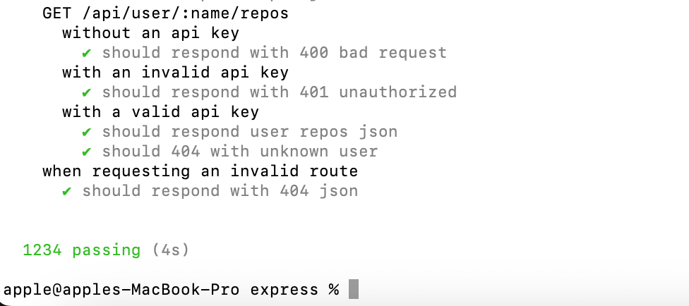
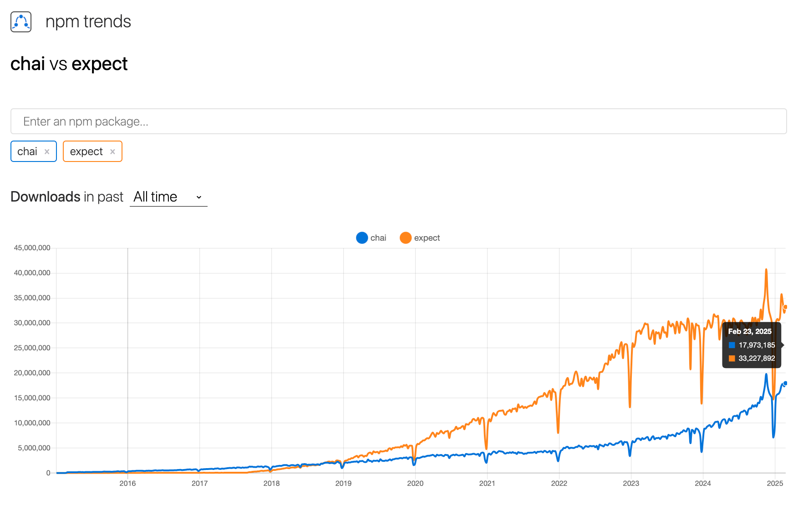

# Learn Mocha

❤️ Documentation: [mochajs.org](https://mochajs.org)

**Quick Links:**
- Learn Mocha - Google Doc: [Click here](https://docs.google.com/document/d/19lJnR9d93wplsKpdd7pfqqXUgKTWL2HZNYyo64mkFSE/edit?tab=t.0)
- **Examples**
  - Examples from Mocha Documentation: [Click here](https://mochajs.org/#examples)
    - Tests of express lib: [Click here](https://github.com/expressjs/express/tree/master/test) [from examples of Chai docs]
  - Tests of connect lib: [Click here](https://github.com/senchalabs/connect/tree/master/test) (Middleware layer for nodejs)
  - Tests of socket.io lib: [Click here](https://socket.io/docs/v4/testing/)
- Clear terminal logs before running tests:
  - Use `-R min` (alias for `--reporter min`) - [src](https://mochajs.org/#min)
    - _Also (Hack): You can use this in your test to clear terminal logs before each run as well - `beforeEach(function () { console.log('\x1Bc'); });` [TESTED]_
- ❤ Mocha is truly blazing fast - The tests in `express` repo takes `4 seconds` to run on my system to run `1234 tests`. 🎉 The results are super fast probably because mocha encourages to use node's native `assert` module to run tests (instead of using a different library for e.g., like `expect` is used by `jest`)
  

# Assertions Library

- Chai: [Docs](https://www.chaijs.com/api/bdd/)
- Expect: [Docs](https://jestjs.io/docs/expect)

## Assertion library: chai vs. expect

- Npm trends: [Click here](https://npmtrends.com/chai-vs-expect)
  - [chai npm](https://www.npmjs.com/package/chai) (github: 8.2k\*) [first release 9 years ago]
  - [expect npm](https://www.npmjs.com/package/expect) (inside a monorepo of jest github: 44.6k\*) [first release 13 years ago]

