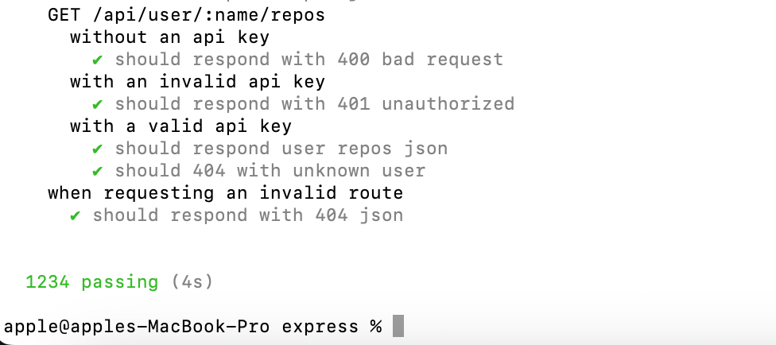

# Learn Mocha

❤️ Doc: [mochajs.org](https://mochajs.org)

**Quick Links:**

- **Examples: [Docs](https://mochajs.org/#examples)**
  - Tests of express lib: [Click here](https://github.com/expressjs/express/tree/master/test) [from examples of Chai docs]
  - Tests of connect lib: [Click here](https://github.com/senchalabs/connect/tree/master/test) (Middleware layer for nodejs)
- Clear terminal logs on restart when watch mode is on:
  - Use `-R min` (`--reporter min`) - [src](https://mochajs.org/#min)
  - _Hack: You can use this in your test to clear terminal logs before each run as well - `beforeEach(function () { console.log('\x1Bc'); });` [TESTED]_

## Mocha is truely blazing fast ❤️

The tests in `express` repo takes `4 seconds` to run on my system to run `1234 tests`. 🎉 The results are super fast probably because mocha encourages to use node's native `assert` module to run tests (instead of using a different library for e.g., like `expect` is used by `jest`)

