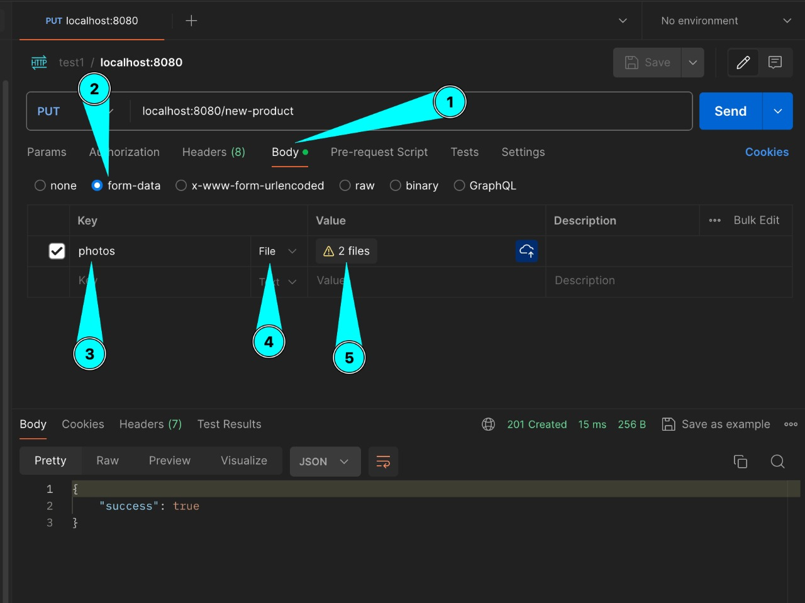
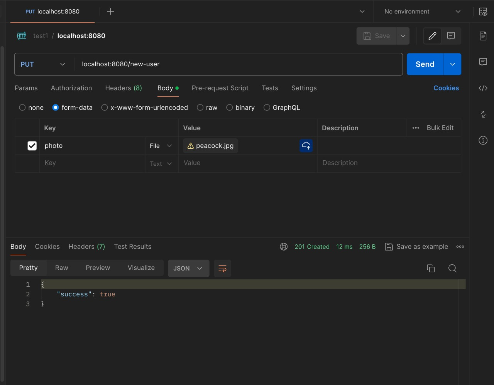
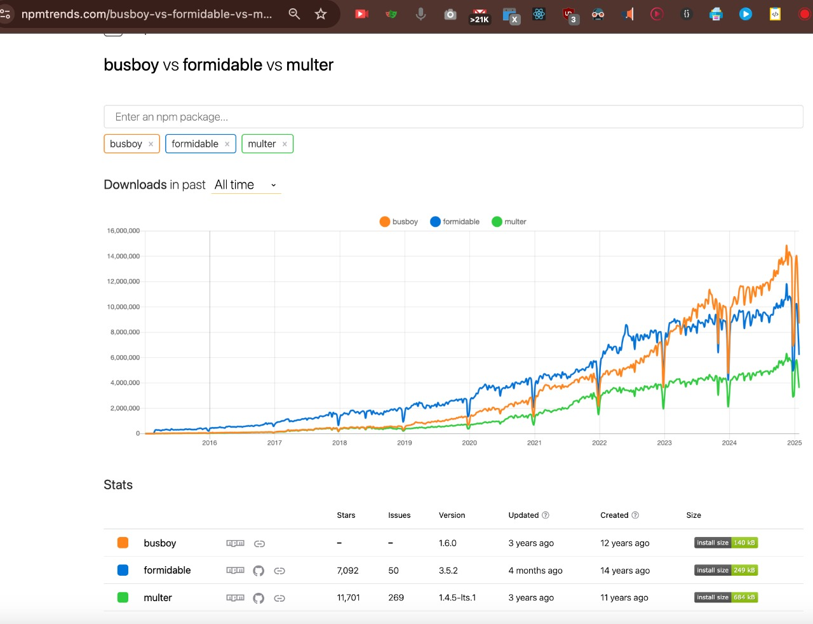

# Learn Multer

## ❤️ Error handling in multer

- [Click here](https://www.npmjs.com/package/multer#error-handling)
  - [multer-error.js](https://github.com/expressjs/multer/blob/master/lib/multer-error.js)

## Todos

**Add code from sla\*\*\*r project for:**

- Maximum file size upload limit and cancel the request. Sahil: I think this validation should also be specified in the frontend too.
  - Write tests for this as well.
- Specify Allowed file type for e.g, jpg, jpeg, gif, etc to restrict uploading any other type of files where an image(s) is required.
  - Write tests for this as well.

## Upload files via postman

**Multi file Upload**

**Single file Upload**

## Multer Alternatives

**Buy why `multer` instead of alternatives?** Because it is official expressjs package - [https://github.com/expressjs/multer](https://github.com/expressjs/multer). From MULTER DOCS: Multer is a node.js middleware for handling multipart/form-data, which is primarily used for uploading files. **It is written on top of `busboy` for maximum efficiency.**

**Alternatives:**

- `formidable`:
  - [npm](https://www.npmjs.com/package/formidable)
  - [github](https://github.com/node-formidable/formidable)
- `busboy` (Note: `multer` uses `busboy` underneath):
  - [npm](https://www.npmjs.com/package/busboy)
  - [github](https://github.com/mscdex/busboy)

https://npmtrends.com/busboy-vs-formidable-vs-multer

