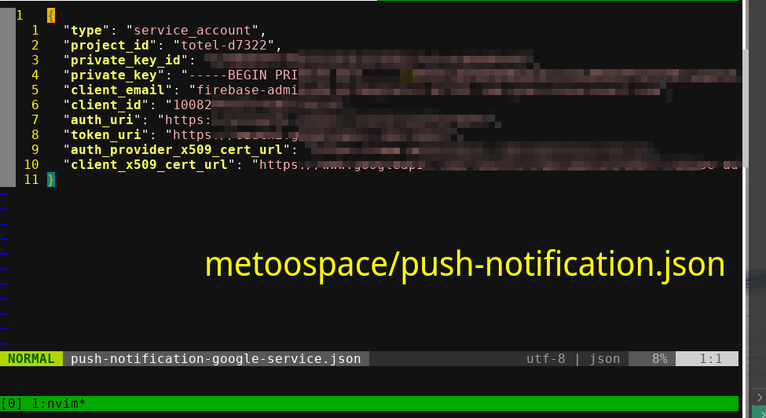

# Learn Web Push Notifications via Node

*Tested on Poco M4 Pro 5G (Android).*

**🚀 Start the server via `nodemon server.js`.**

**Quick Links:**
- Inspiration - Push Notifications Using Node.js & Service Worker by Brad Traversy: [Click here](https://youtu.be/HlYFW2zaYQM)
    - [Github](https://github.com/bradtraversy/node_push_notifications)
- **❤️ MDN Docs:** [Click here](link-3)
- Quora - How do push notificaitons work: [Click here](https://www.quora.com/How-do-push-notifications-work-for-desktop-and-mobile-applications)
- Test Notifications:
    - [tests.peter.sh/notification-generator][link-2]
	- [bennish.net/web-notifications][link-4] (Works on desktop, **NOT** on Android)
 	- [cleverpush.com/en/test-notifications][link-5] (Does **NOT** work on desktop, works on Android)
  	- [pushalert.co/demo][link-6] (Works on desktop AND works on Android)
- ❤️ My Github Repository - Simple Service Worker: [Click here][link-1]

## Generate vapid keys:

```bash
npx web-push generate-vapid-keys
# Another way is to directly run `./node_modules/.bin/web-push generate-vapid-keys`
```

Learn: To be able to send notification you only need to open url `localhost:6001` on the target device to receive notification. For more info check file `client/client.js`.


[link-1]: https://github.com/sahilrajput03/learn-react/tree/main/simple_service_worker
[link-2]: https://tests.peter.sh/notification-generator
[link-3]: https://developer.mozilla.org/en-US/docs/Web/API/Notifications_API/Using_the_Notifications_API
[link-4]: https://www.bennish.net/web-notifications.html
[link-5]: https://cleverpush.com/en/test-notifications
[link-6]: https://pushalert.co/demo

## In metoospace project

**Sample json thing? What is this?*

